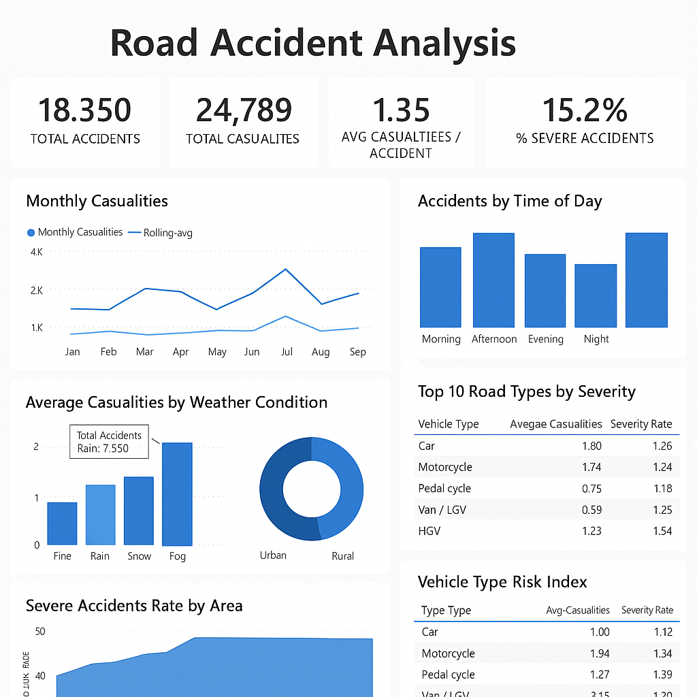

# 🚧 Road Accident Analysis Project

This project analyzes real-world road accident data to uncover high-risk patterns, peak accident timings, vehicle types involved, and the effect of environmental factors. The analysis is done using **SQL**, **Pandas (Python)**, and visualized using **Power BI**.

---

## 📁 Project Structure

```
road-accident-analysis-project/
│
├── data/                      # Raw and cleaned CSV files
│   ├── Road_Accidents_Sample.csv
│   ├── time_band_distribution.csv
│   ├── weather_vs_casualties.csv
│   └── ...
│
├── notebook/                 # Jupyter/Colab notebook
│   └── Road_Accident_Analysis.ipynb
│
├── sql/                      # SQL queries
│   └── road_accident_queries.sql
│
├── visuals/                  # Power BI mockups or screenshots
│   └── dashboard_layout_mockup.png
│
├── README.md
└── requirements.txt (optional)
```

---

## 🔧 Tools Used

- Python (Pandas, Matplotlib)
- SQL (Microsoft SQL Server)
- Power BI (for visualization)
- Google Colab (for notebook execution)

---

## 📊 Key Insights

- 🔥 Most accidents occur at **night** and **early morning**
- 🌧️ Accidents during **rainy/foggy weather** have higher casualty rates
- 🏙️ **Rural areas** report higher severity than urban areas
- 🚗 **Two-Wheelers** and **Pedestrians** are most vulnerable
- 🛣️ Certain road types (e.g. single carriageway) show higher fatality rate

---

## 🚀 How to Run

1. Open `notebook/Road_Accident_Analysis.ipynb` in Google Colab
2. Upload the dataset from the `data/` folder
3. Run all cells to generate all insights and exports
4. Optionally, visualize insights using Power BI or Excel

---

## 🖼️ Dashboard Preview



---

## 📬 Contact

**Ashutosh Kumar Singh**  
[LinkedIn Profile](https://www.linkedin.com/in/ashutosh-kumar-singh-dataanalyst)  
📧 ashutoshsinghvns08@gmail.com

---

Feel free to fork or star ⭐ this repo if you found it helpful!
